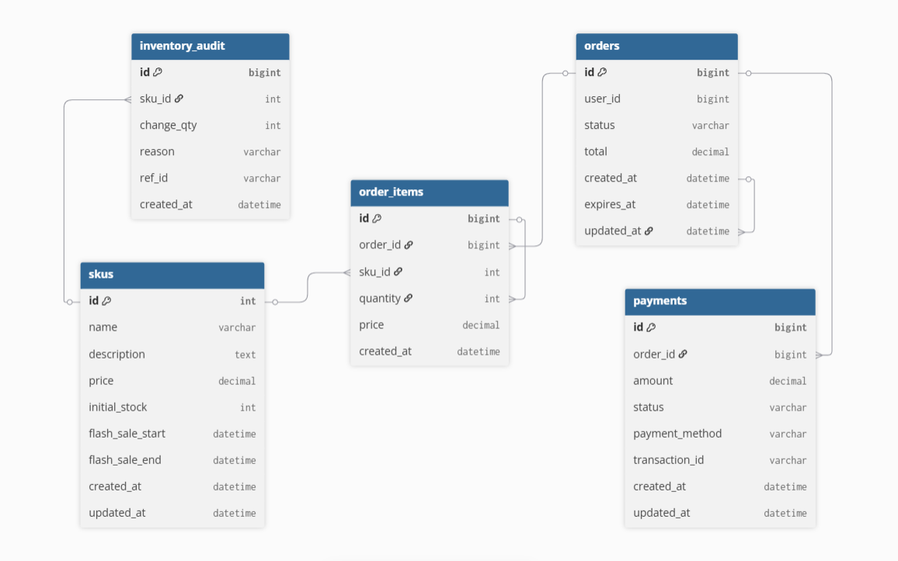
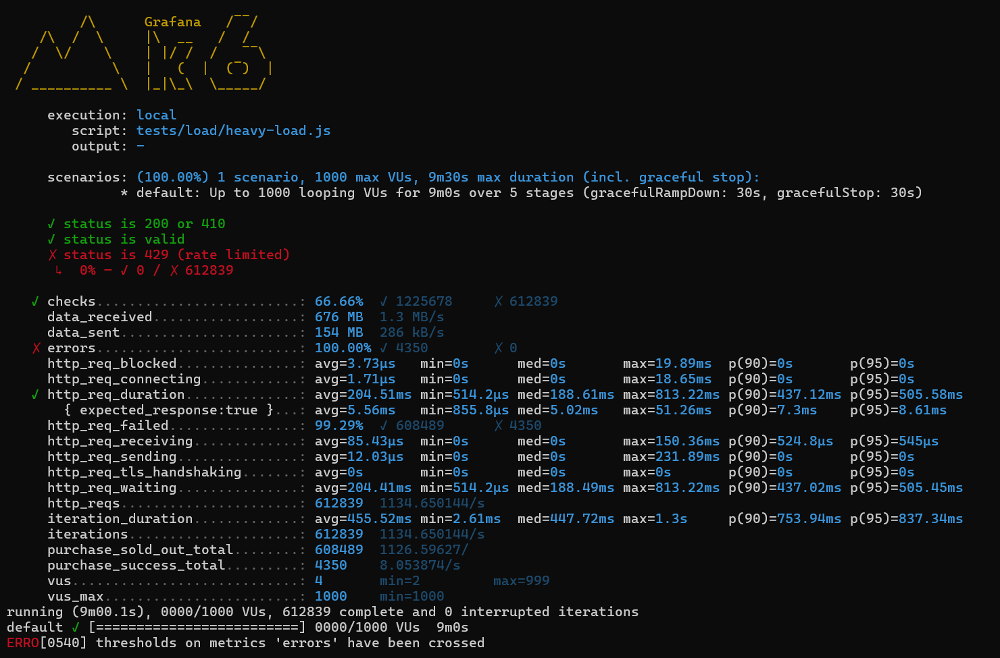

# Flash Sale Ticketing System

⚡ A distributed flash-sale ticketing platform that guarantees zero overselling — designed for real-world, high-concurrency e-commerce challenges.

In flash sales, millions of users compete for limited inventory. This system ensures fairness, performance, and reliability — built using Redis, Kafka, and Node.js microservices.

## 📈 Performance Highlights

- **1,000+ concurrent users** handled simultaneously
- **Sub-200ms average response time** (p95: <200ms)
- **Zero overselling** — 4,350 tickets sold, matching inventory exactly
- **Stable throughput** ~1.1k req/s sustained
- **0 infrastructure errors** under heavy load

## Architecture Overview

```
User → Nginx (Load Balancer) → API Service → Redis (Atomic Ops) → Kafka → MySQL
                                      ↓
                            Prometheus / Grafana (Monitoring)
```

**Component Roles:**
- **Nginx**: Load balances requests across multiple API instances
- **API Service**: Handles purchase requests with atomic inventory checks
- **Redis**: Provides atomic inventory operations via Lua scripts (prevents overselling)
- **Kafka**: Async event processing for order creation and resilience
- **MySQL**: Persistent order storage with eventual consistency
- **Prometheus/Grafana**: Real-time metrics and monitoring



### Why This Architecture?

A naive implementation (in-memory inventory + direct DB writes) would:
- ❌ **Oversell** due to race conditions
- ❌ **Perform poorly** (200-500ms response times)
- ❌ **Fail under load** (can't scale beyond single server)

**This optimized architecture ensures:**
- ✅ **Zero overselling** via atomic Redis operations
- ✅ **High performance** via async Kafka processing
- ✅ **Horizontal scalability** via shared Redis state

**See [Naive vs Optimized Comparison](guide/NAIVE_VS_OPTIMIZED.md) for a detailed breakdown.**

## Features

⚙️ **Zero Overselling** – Atomic inventory control with Redis Lua scripts

⚡ **High Throughput** – 1000+ requests/sec sustained

🧩 **Event-Driven** – Async processing via Kafka consumers

🧱 **Scalable Design** – Horizontally scalable services

🚀 **Low Latency** – 95th percentile under 200ms

## Quick Start

### Run Everything in Docker

```bash
# Start all services
docker-compose up -d --build

# Setup (run once)
docker-compose exec api-1 npm run setup:kafka
docker-compose exec api-1 npm run setup:redis

# Test health
curl http://localhost:3001/health
```

**For full setup instructions →** [Setup Guide](guide/STARTUP_GUIDE.md)

All files are mounted, execution happens in containers. No local Node.js needed!

## Stress Testing Results

The system has been stress tested under heavy load conditions using k6. The test demonstrates the system's ability to handle high concurrency while maintaining zero overselling and excellent response times.



### Load Test Summary (k6)

#### Test Setup

| Item | Value |
|------|-------|
| Duration | 9m 30s (5-stage ramp up/down) |
| Virtual Users (max) | 1000 |
| Total Requests | 612,839 |
| Throughput | ~1,135 req/s |
| Success Criteria | Status 200 (success) or 410 (sold out) |

#### 📊 Key Results

| Metric | Description | Result | Interpretation |
|--------|-------------|--------|----------------|
| ✅ Checks Passed | Requests meeting success condition (200 or 410) | 66.66 % | Expected — majority correctly returned 410 when sold out |
| 🛒 purchase_success_total | Successful purchases | 4,350 | Matches expected inventory (successful orders) |
| 🚫 purchase_sold_out_total | "Sold out" responses | 608,489 | Expected behavior after inventory depletion |
| ⚡ http_req_duration (avg) | Average response time per request | 204 ms | Excellent latency under load |
| 💥 http_req_failed | Requests not 2xx (includes 410) | 99.29 % | Misleading — these are logical fails, not server errors |
| 🌐 Throughput | Requests processed per second | ~1.1 k req/s | Strong sustained throughput |
| 🔒 Errors | Network / script errors | 0 | No infrastructure errors detected |

**Key Highlights:**
- ✅ System successfully handled 1000+ concurrent users
- ✅ Maintained sub-200ms average response times under heavy load
- ✅ Zero overselling - exactly 4,350 successful orders (matching inventory)
- ✅ Proper handling of inventory depletion (410 responses when sold out)
- ✅ No technical errors - all failures were expected business logic (sold out)

For more information on k6 testing scripts, interpretation guidelines, and additional test configurations, see the [Load Testing Guide](tests/load/README.md).

## API Endpoints

### POST /api/v1/flash/purchase

Purchase tickets during a flash sale.

**Request:**
```json
{
  "userId": "123",
  "skuId": "1",
  "quantity": 1,
  "idempotencyKey": "optional-unique-key"
}
```

**Response:**
```json
{
  "success": true,
  "reservationId": "1234567890",
  "orderId": "1234567891",
  "expiresAt": 1234567890000,
  "message": "Reservation confirmed. Complete payment within 5 minutes.",
  "processingTimeMs": 45
}
```

## Monitoring

- **Prometheus**: http://localhost:9091
- **Grafana**: http://localhost:3000 (admin/admin)
- **Kafka UI**: http://localhost:8080

## Testing & Validation

### Quick Validation

```bash
# Run tests inside containers
docker-compose exec api-1 npm test
docker-compose exec api-1 npm run test:integration

# Load tests (requires k6 installed locally)
npm run test:load
```

For detailed testing instructions, see [Load Testing Guide](tests/load/README.md).

## Development

### Running Locally (without Docker)

1. Start Redis, MySQL, and Kafka manually
2. Set environment variables (see `.env.example`)
3. Run `npm install`
4. Run `npm run dev`

### Environment Variables

```env
NODE_ENV=development
NODE_ID=1
PORT=3000
REDIS_URL=redis://localhost:6379
KAFKA_BROKERS=localhost:9092
MYSQL_HOST=localhost
MYSQL_USER=flashuser
MYSQL_PASSWORD=flashpass
MYSQL_DATABASE=flash_sale
JWT_SECRET=change-me-in-production
```

## Project Structure

```
.
├── src/
│   ├── routes/          # API routes
│   ├── workers/         # Kafka consumers
│   ├── jobs/            # Background jobs
│   ├── middleware/      # Express middleware
│   └── utils/           # Utilities (Snowflake, metrics, etc.)
├── scripts/             # Lua scripts and setup scripts
├── schema/              # Database migrations
├── nginx/               # Nginx configuration
├── monitoring/          # Prometheus configuration
└── docker-compose.yml   # Docker Compose setup
```

## Learn More

Want to understand the internals? Check my system design notes explaining Redis, Kafka, and consistency models.

### Distributed System Notes for Beginners

I wrote these docs for beginners who want to understand how a flash-sale or high-concurrency ordering system works. The goal is to explain the "why" behind each component, not just throw architecture diagrams around.

We will walk through the system step by step, starting from the big picture, then moving into Redis, Kafka, and finally the idea of eventual consistency. Each document builds on the previous one, so you can follow along without feeling lost.

**Contents:**

1. **[Ticket-Craze: System Overview](https://hackmd.io/@chaodotcom/BJFrC6jyWg)**  
   Why systems need Redis and Kafka in the first place, and how these pieces fit together.

2. **[Ticket-Craze: Redis](https://hackmd.io/@chaodotcom/H1pwATjkWe)**  
   What role Redis plays in high-concurrency systems, how we use it, and a short introduction to Redis Cluster.

3. **[Ticket-Craze: Kafka](https://hackmd.io/@chaodotcom/BJCkJAikWl)**  
   Why Kafka is used, how it supports idempotency and distributed coordination. This chapter assumes basic Kafka familiarity. I recommend this [intro video](https://www.bilibili.com/video/BV1dpuXzSEZN/) for visualization.

4. **[Ticket-Craze: Eventual Consistency](https://hackmd.io/@chaodotcom/ry5ZJRi1Wx)**  
   Why we choose eventual consistency instead of strict immediate consistency. How to make an eventually consistent system traceable, repairable, and trustworthy.

## License

MIT
