# Flash Sale Ticketing System

A production-grade, high-concurrency flash sale ticketing system capable of handling thousands of concurrent requests with zero overselling.

## Documentation Links

1. [Overview](https://hackmd.io/@chaodotcom/BJFrC6jyWg)
2. [Redis](https://hackmd.io/@chaodotcom/H1pwATjkWe)
3. [Kafka](https://hackmd.io/@chaodotcom/BJCkJAikWl)
4. [Eventual Consistency Architecture](https://hackmd.io/@chaodotcom/ry5ZJRi1Wx)

## Features

- **High Concurrency**: Handle 1000+ requests/second during flash sales
- **Zero Overselling**: Atomic inventory control using Redis Lua scripts
- **Fast Response**: Sub-200ms API response times
- **Event-Driven**: Resilient async processing with Kafka
- **Horizontally Scalable**: All components can scale independently

## Architecture

### System Architecture Diagram

```mermaid
graph TB
    User[User/Browser] -->|HTTP POST| Nginx[Nginx Load Balancer]
    Nginx -->|Load Balance| API1[API Server 1]
    Nginx -->|Load Balance| API2[API Server 2]
    
    API1 -->|Check Inventory| Redis[(Redis)]
    API1 -->|Publish Event| Kafka[Kafka]
    API2 -->|Check Inventory| Redis
    API2 -->|Publish Event| Kafka
    
    Redis -->|Inventory Data| API1
    Redis -->|Inventory Data| API2
    
    Kafka -->|Consume| Worker[Order Worker]
    Worker -->|Insert Order| MySQL[(MySQL)]
    Worker -->|Publish| Kafka2[Kafka Orders Topic]
    
    Cleanup[Cleanup Job] -->|Query Expired| MySQL
    Cleanup -->|Return Inventory| Redis
    
    Prometheus[Prometheus] -->|Metrics| API1
    Prometheus -->|Metrics| API2
    Grafana[Grafana] -->|Query| Prometheus
    
    style Redis fill:#dc382d
    style MySQL fill:#00758f
    style Kafka fill:#231f20
    style Nginx fill:#009639
```



### Database Schema ERD


## Quick Start

### Prerequisites

- **Docker Desktop** (that's it! No need for Node.js locally)

**Container Setup (Recommended - Works on all platforms!):**
```bash
# Start all services
docker-compose up -d --build

# Setup Kafka topics
docker-compose exec api-1 npm run setup:kafka

# Initialize Redis inventory
docker-compose exec api-1 npm run setup:redis

# Test health
curl http://localhost:3001/health
```

All files are mounted, execution happens in containers. No local Node.js needed!

### Alternative: Local Development

- Docker and Docker Compose (for services)
- Node.js 18+ (for running the app locally)

### 1. Start Infrastructure

```bash
docker-compose up -d
```

This starts:
- Redis (port 6379)
- MySQL (port 3306)
- Kafka + Zookeeper (ports 9092, 2181)
- Kafka UI (port 8080)
- API servers (ports 3001, 3002)
- Nginx (port 80)
- Prometheus (port 9090)
- Grafana (port 3000)

### 2. Setup Kafka Topics

```bash
npm install
npm run setup:kafka
```

### 3. Initialize Inventory

```bash
npm run setup:redis
```

### 4. Test the API

```bash
# Make a purchase request
curl -X POST http://localhost/api/v1/flash/purchase \
  -H "Content-Type: application/json" \
  -d '{
    "userId": "123",
    "skuId": "1",
    "quantity": 1,
    "idempotencyKey": "test-key-1"
  }'
```

## Development

### Running Locally (without Docker)

1. Start Redis, MySQL, and Kafka manually
2. Set environment variables (see `.env.example`)
3. Run `npm install`
4. Run `npm run dev`

### Environment Variables

```env
NODE_ENV=development
NODE_ID=1
PORT=3000
REDIS_URL=redis://localhost:6379
KAFKA_BROKERS=localhost:9092
MYSQL_HOST=localhost
MYSQL_USER=flashuser
MYSQL_PASSWORD=flashpass
MYSQL_DATABASE=flash_sale
JWT_SECRET=change-me-in-production
```

## Testing & Validation

### Quick Validation

```bash
# 1. Start all services
docker-compose up -d --build

# 2. Setup (run once)
docker-compose exec api-1 npm run setup:kafka
docker-compose exec api-1 npm run setup:redis

# 3. Test health
curl http://localhost:3001/health

# 4. Test purchase
curl -X POST http://localhost/api/v1/flash/purchase -H "Content-Type: application/json" -d '{"userId":"123","skuId":"1","quantity":1,"idempotencyKey":"test-1"}'

# 5. Run tests
docker-compose exec api-1 npm test
docker-compose exec api-1 npm run test:integration

# 6. View logs
docker-compose logs -f api-1
```

### Automated Tests

```bash
# Run tests inside containers
docker-compose exec api-1 npm test
docker-compose exec api-1 npm run test:integration

# Run any command in container
docker-compose exec api-1 npm run setup:kafka
docker-compose exec api-1 node scripts/init-inventory.js

# Load tests (requires k6 installed locally)
npm run test:load
```

## Monitoring

- **Prometheus**: http://localhost:9090
- **Grafana**: http://localhost:3000 (admin/admin)
- **Kafka UI**: http://localhost:8080

## API Endpoints

### POST /api/v1/flash/purchase

Purchase tickets during a flash sale.

**Request:**
```json
{
  "userId": "123",
  "skuId": "1",
  "quantity": 1,
  "idempotencyKey": "optional-unique-key"
}
```

**Response:**
```json
{
  "success": true,
  "reservationId": "1234567890",
  "orderId": "1234567891",
  "expiresAt": 1234567890000,
  "message": "Reservation confirmed. Complete payment within 5 minutes.",
  "processingTimeMs": 45
}
```

## Project Structure

```
.
├── src/
│   ├── routes/          # API routes
│   ├── workers/         # Kafka consumers
│   ├── jobs/            # Background jobs
│   ├── middleware/      # Express middleware
│   └── utils/           # Utilities (Snowflake, metrics, etc.)
├── scripts/             # Lua scripts and setup scripts
├── schema/              # Database migrations
├── nginx/               # Nginx configuration
├── monitoring/          # Prometheus configuration
└── docker-compose.yml   # Docker Compose setup
```

## Performance

- **API Response Time**: <200ms (p95)
- **Throughput**: 1000+ req/sec
- **Inventory Operations**: Atomic via Redis Lua scripts
- **Event Processing**: Async via Kafka

## License

MIT

